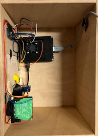

**HAUS MIT SICHERHEITSTÜR**

NwT-Abschlussprojekt J2

Teilnehmer: Mona Endreß, Lutz Engler, Max Stacherowski, David Völlm

Zeitraum: 06.02.2023-22.05.2023

**INHALTSVERZEICHNIS**

1. **Einleitung**                                                       3
1. **Vorbereitungsphase**                                               4
   1. Projektauftrag                                                    4
   1. Projektziele                                                      4
1. **Planungsphase**							                                 4
   1. Projektstrukturplan/ Arbeitspakete                                4
   1. Projektzeitplan                                                   5
   1. Recherche                                                         5
   1. Bauteile                                                          6
   1. Schaltung                                                         6
1. **Durchführungsphase**                                               7
   1. Funktionsbeschreibung                                             7
   1. Ablauf                                                            7
   1. Anhänge                                                           8
   1. Aufgabenbereiche                                                  8
1. **Abschlussphase**                                                   9
   1. Ist-Soll-Vergleich                                                9
   1. Fehleranalyse/ Verbesserungsvorschläge                            9
   1. Zusammenfassung/ Resümee                                          10
1. **Quellenangaben**                                                   10
   1. Literaturverzeichnis                                              10
   1. Internetquellenverzeichnis                                        10

**1. EINLEITUNG**

Wir wollen ein Miniaturhaus mit einer Sicherheitstüre bauen. Diese soll nur aufschließen, wenn eine Person anhand eines Gesichtserkennungsprogramms erkannt wird. 

Die Sicherheit und Privatsphäre gewann in den letzten Jahren immer mehr an Wichtigkeit und ist ein relevantes Thema für die Zukunft. Durch das wachsende Bewusstsein des Ersetzens von „altmodischen“ Begebenheiten durch neue Technologien, ist ein Fortschritt in allen Lebenssituationen unabdingbar. Das Leben der Menschen so effizient und unkompliziert wie möglich zu gestalten ist ein wichtiger Faktor im privaten Sektor. Bereits seit ein paar Jahren ist die Gesichtserkennung immer mehr bei Smartphones, Tablets usw. vertreten. Aber auch auf politischer, wirtschaftlicher und gesellschaftlicher Ebene gewinnt die künstliche Intelligenz beziehungsweise die Gesichtserkennung immer mehr an Bedeutung. So wird diese zum Beispiel für Massenüberwachungen, Zugangskontrollen oder die Suche nach Straftätern verwendet.  

1966 erschuf Woodrow „Woody“ Wilson Bledsoe eine Rechenmaschine, die „Computer-Person“, die die Anfänge der Gesichtserkennung mit Hilfe der künstlichen Intelligenz markierte. Das Grundprinzip einer solchen Maschine besteht daraus ein spezifisches Muster aus Bildern herauszufiltern und anschließend in binäre Codezeilen umzurechnen. Daraufhin wird diese Code-Kette mit einer Datenbank abgeglichen und über einen anderen Mechanismus an den Verbraucher signalisiert. Bei Woody zum Beispiel über einen angeschlossenen Ohrknopf. [\[1\]](https://www.boonedam.de/blog/das-gesicht-der-zukunft-erkennen#_ftn1) [\[4\]](https://www.boonedam.de/blog/das-gesicht-der-zukunft-erkennen#_ftn1) Das heißt die Gesichtserkennung ist kein neues Phänomen, sondern schon seit Jahrzehnten im stetigen Wandel. Nur hat sich die Funktionsweiße der Gesichtserkennung immer weiterentwickelt.

AnyVision ist der weltweit führende Entwickler von Computer Vision Software mit künstlicher Intelligenz für die Gesichtserkennung. „Die Mission von AnyVision ist es, künstliche Intelligenz weltweit zugänglich zu machen. Auf diese Weise entsteht ein Netzwerk intelligenter Geräte und setzt neue Standards für die Sicherheit in der Welt um uns herum“, erklärt Ray Brancato, Chief Revenue Officer bei AnyVision. [\[2\]](https://www.boonedam.de/blog/das-gesicht-der-zukunft-erkennen#_ftn1) So schön dieses Zitat von AnyVision klingt, die Gesichtserkennung hat auch ihre Schattenseiten. Regierungen können ihre Bevölkerung überwachen und kontrollieren und ein Verlust von Privatsphäre kann verstärkt auftreten. Ein Beispiel hierfür wäre China, wo Datenschutz über keine sonderliche Relevanz verfügt und die Bevölkerung quasi durchgehend überwacht wird. [\[3\]](https://www.boonedam.de/blog/das-gesicht-der-zukunft-erkennen#_ftn1) Auch sind Computersysteme im Vergleich zu Schlüssel und Schloss anfällig für Hackerangriffe. 

Deshalb möchten wir uns mit diesem Projekt damit beschäftigen die Gesichtserkennung so zu verwenden, dass die Privatsphäre der Menschen steigt und gleichzeitig eine Vereinfachung des Lebens stattfindet.

`	`**2. VORBEREITUNGSPHASE**

**2.1. Projektauftrag**

In einer Gruppe (2er-4er Teams) wird bis zum 22.05.2023 ein technisches Gerät entwickelt.

Das Projekt wird am 22.05.2023 präsentiert und die Dokumentation am 15.05.2023 fertiggestellt, ausgedruckt, digital und persönlich abgegeben. Ein erster Dokumentationsentwurf wird am 31.03.2023 abgegeben.

**2.2. Projektziele**

Ein Haus mit Sicherheitstür soll erstellt werden. Die Tür kann nur durch ein Gesichtserkennungsprogramm nach außen geöffnet werden. Ein Knopf („Klingel“) startet das Programm und bei Erkennung einer Person öffnet sich das Schloss. Eine LED sowie ein Tonsignal eines Buzzers sollen angeben ob das Gesicht erkannt wurde und die Person berechtigt ist durchzugehen. 

`	`**3. PLANUNGSPHASE**

**3.1. Projektstrukturplan**

**3.2. Projektzeitplan**

||
Woche 1

6/9.2.23
|
Woche 2

13/16.2.23
|
Woche 3

27\.2/2.3.23
|
Woche 4

6/9.3.23
|
Woche 5

13/16.3.23
|
Woche 6

20/23.3.23
|
Woche 7

27/30.3.23
|
Woche 8

8/11.5.23
|
| :- | :- | :- | :- | :- | :- | :- | :- | :- |
|Planung, Ideen|x|x|||||||
|**Programmierung**||x|x|x|x|x|x||
|Kamera|||x||||||
|**CAD**||x||x||x|x||
|**Dokumentation**|||x||||x|x|
|Testen||||||x||x|
|Sägen; Bohren|||||x||x||
|Zusammenbau||||||||x|
|Knopf||||||||x|

|**ABGABE**|
31\.03.2023

(Entwurf Dokumentation)
|
15\.05.2023

(Dokumentation)
|
22\.05.2023

(Präsentation)
|
| :-: | :-: | :-: | :-: |

**3.3. Recherche:**

**Raspberry Pi: [\[5\]](https://www.boonedam.de/blog/das-gesicht-der-zukunft-erkennen#_ftn1)**

Der Raspberry Pi ist ein kostengünstiger (ca. 40€) kleiner Computer. Da er leider aktuell nicht mehr produziert wird, sind die wenigen übrigen Exemplare sehr teuer. Er wurde für die Universität Cambridge von der Raspberry Pi Foundation entwickelt. Es handelt sich um einen Einplatinen-Computer, der über kein Netzteil verfügt. Das passende Betriebssystem sind die Linux Distributionen.

Meistens wird dieser Mini-Computer als Steuerungs-Computer, Roboter-Komponente oder Multimedia-Center verwendet.

**Gesichtserkennung: [\[6\]](https://www.boonedam.de/blog/das-gesicht-der-zukunft-erkennen#_ftn1)**

„Die Gesichtserkennung ist ein Verfahren zur Identifizierung oder Bestätigung der Identität einer Person anhand ihres Gesichts. Gesichtserkennungssysteme können für die Bestimmung von Personen auf Fotos, in Videos oder in Echtzeit eingesetzt werden. Die Gesichtserkennung ist eine Kategorie der biometrischen Sicherheit.“

**3.4. Bauteile**

Die verwendeten Bauteile können in 3 Bereiche unterteilt werden:

|**3D gedruckte Teile**|**Elektrische Bauteile**|**Andere**|
| :- | :- | :- |
|LED-Gehäuse|LED|2 x 250x180x5mm Holzplatte|
|Servo-Gehäuse|Knopf|2 x 250x150x5mm Holzplatte|
|Schloss (2-teilig)|Türsensor|2 x 180x150x5mm Holzplatte|
|Türgriff|Servo-Motor|4 x M3 30mm Schraube|
|Raspberry Pi Gehäuse|Buzzer (passiv)|4 x M3 Mutter|
|2 Scharniere|Lüfter|4 x M3 15mm Schraube|
|Tür Stopper|2 x 10kΩ Widerstand|4x M3 Mutter|
||220Ω Widerstand||
||Kabel||
||Raspberry Pi 4b (8GB)||
||Logitech Webcam 250||
||Netzteil (15W, 5V)||
||Micro HDMI-HDMI Adapter||
||USB Maus und Tastatur||
||Bildschirm (HDMI Anschluss)||

Die 3D gedruckten Teile finden sich alle unter dem [Ordner CAD](https://github.com/DavidVoellm/HouseWithFaceRecognition/tree/master/CAD), da drin sind auch die Technischen Zeichnungen.

**3.5. Schaltung**

Die Schaltung wollten wir nicht mit einer Platine verwirklichen, da wir die Bauteile nicht direkt auf die Platine löten wollten und man auch keine Platine direkt auf den Raspberry Pi stecken kann.

Durch zu kurze Kabel sind die Anschlüsse bei unserem Projekt etwas vertauscht: 
Knopf: 22; Servo: 27; Tür: 17; Buzzer: 26
Der Rest bleibt gleich.

`	`**4. DURCHFÜHRUNGSPHASE**

**4.1. Funktionsbeschreibung**

Beim Starten des Programms, leuchtet die LED so lange orange, bis alle Initialisierungen fertig sind, dann leuchtet sie grün.

Während des Auf- und Zuschließvorgangs leuchtet die LED wieder orange, nach dem Aufschließen leuchtet sie dann grün und nach dem Zuschließen leuchtet sie rot.

Um die Gesichtserkennung zu starten, muss die Klingel gedrückt werden. Dann leuchtet die LED blau und es wird mit der Kamera ein Bild aufgenommen. Dieses wird nach bekannten Gesichtern untersucht. Wenn mindestens ein bekanntes Gesicht erkannt wird, wird die Türe aufgeschlossen, ansonsten piept der Alarm und die Türe bleibt verschlossen.

Neue Person hinzufügen (Mona, David): Wenn eine Person mit Zugriff die Türe aufschließt, aber noch nicht öffnet, kann eine neue Person hinzugefügt werden. Nach 2-sekündigem Drücken der Klingel beginnt die LED blau zu leuchten. Sobald die Klingel dann losgelassen wird, blinkt sie drei Mal blau und nach 1.5 Sekunden leuchtet die LED weiß. Jetzt wird eine neue Person hinzugefügt, sobald sich nur eine unbekannte Person im Bild befindet. Es kann pro Aufschließvorgang immer nur eine neue Person hinzugefügt werden und der ganze Vorgang kann immer durch ein kurzes Drücken der Klingel abgebrochen werden.

*(Das Programm lässt sich in dem Ordner [Software](https://github.com/DavidVoellm/HouseWithFaceRecognition/Software) dokumentiert vorfinden. Die Dateien in dem Ordner [Bibliotheken](https://github.com/DavidVoellm/HouseWithFaceRecognition/Software/Bibliotheken), stammen natürlich auch von uns und gehören zum Projekt.)*

**Eine Erklärung, wie das Programm zu starten ist, findet sich [hier](https://github.com/DavidVoellm/HouseWithFaceRecognition/blob/master/Wie%20starte%20ich%20das%20Programm.pdf).**

**4.2. Ablauf**

Wir haben damit begonnen, Testprogramme für die Gesichtserkennung zu schreiben, um zu wissen, ob unser Plan überhaupt möglich ist. Nachdem das funktioniert hat, haben wir das Betriebssystem Rasbian auf dem Raspberry Pi aufgesetzt. Dann haben wir angefangen 3D Modelle für Halterungen zu designen und einzelne elektrische Bauteile anzusteuern. Währenddessen hatten wir einige Schwierigkeiten bei der Kamera Auswahl, da einige nicht so funktioniert haben, wie es geplant war, deshalb haben wir schlussendlich eine USB-Webcam genommen. Als nächstes haben wir die Wände gesägt und zusammengeklebt und gleichzeitig die Gesamtschaltung gebaut und getestet. Mit dem Bau der Schaltung haben wir gleichzeitig das Programm angepasst und getestet. Dieses Teil hat den größten Teil des Projekts in Anspruch genommen. Als dieser Teil auch fertig war, kam der Zusammenbau, des gesamten Projekts, dazu gehörte das Verlöten der Schaltung, das Einbauen der elektrischen Bauteile in die Wand und das Anschließen der Kabel an den Raspberry Pi.

**4.3. Anhänge**

Auf dem beigefügten Stick befinden sich die zusätzlichen Dateien (erklärter Programmcode, Frizzing, CAD-Komponenten, Nachbau der Boxteile in freeCAD…), die in der Dokumentation, um Dopplungen zu vermeiden, nicht eingefügt wurden (Alle diese Anhänge befinden sich aber auch aktualisiert auf [meinem GitHub Repo](https://github.com/DavidVoellm/HouseWithFaceRecognition)).

**4.4. Aufgabenbereiche**
 (Wer hat was gemacht)

`	`**5. ABSCHLUSSPHASE**

**5.1.Ist-Soll-Vergleich**

|**SOLL**|**IST**|
| :-: | :-: |
|Bis zu 22.05.2023 soll ein technisches Gerät entwickelt werden.|Am 22.05.2023 wurde das Projekt fertig abgegeben.|
|Ein Dokumentationsentwurf wird am 31.03.2023 abgegeben.|Ein Dokumentationsentwurf wurde am 31.03.2023 abgegeben.|
|Die vollständige Dokumentation wird am 15.05.2023 abgegeben.|Aufgrund von Verschiebungen der Unterrichtstunden wurde der Abgabetag auf den 22.05.2023 verlegt. Die Dokumentation wurde digital, ausgedruckt und abgegeben.|
|Eine Präsentation des Projektes findet am 22.05.2023 statt.|Die Präsentation wurde auf den 25.05.2023 verlegt.|
|Ein Haus mit Sicherheitstür soll erstellt werden. Die Tür kann verschlossen werden und wird nach außen geöffnet werden. Ein Knopf („Klingel“) startet das Programm und bei Erkennung einer Person öffnet sich das Schloss. |Eine Box, die wie ein Haus fungiert, mit Sicherheitstür wurde erstellt. Hierfür wurden die gestellten Ressourcen, CAD, Holz, usw., verwendet. Ein Knopf startet das Programm und es öffnet sich das Schloss. |
|Eine LED sowie ein Tonsignal eines Buzzers sollen angeben ob das Gesicht erkannt wurde und die Person berechtigt ist durchzugehen.|Die LED zeigt immer den Programmstatus an, aber der Buzzer ist beim Löten kaputt gegangen und funktioniert nicht mehr (Er hat zuvor aber funktioniert).|
|Es sollen Bauteilgehäuse gebaut werden.|Es wurde kein Buzzer Gehäuse gebaut, da es platztechnisch praktischer ohne war.|
|Eine passende Kamera soll ausgewählt werden.|Es wurde eine USB-Webcam ausgewählt.|
|Mit einer Kamera werden Bilder aufgenommen, die dann nach bekannten Personen untersucht werden.|Bilder können aufgenommen werden und ein System aus Bilderkennung und Personenhandler wertet diese aus. Neue Personen können hinzugefügt werden.|

**5.2. Fehleranalyse und Verbesserungsvorschläge**

|**FEHLER**|**VERBESSERUNG**|
| :-: | :-: |
|Die Kameraauswertung ist manchmal fehlerhaft.|Kleine Toleranzwertveränderungen, aber Gesichtserkennung mit nur einem 2-dimensionalem Bild ist nicht sehr genau.|
|Der Raspberry Pi ist kaputt gegangen.|Es musste ein neuer gekauft werden.|
|Beim zusammenleimen der Holzplatten wurden die platten zu stark zusammengezogen und sie waren nicht mehr rechtwinklig zueinander.|Es wurde Holz dazwischen gesteckt, um die rechten Winkel zu bewahren.|
|Der Kleber war nicht stark genug, um manche 3D-Teile zu befestigen.|Es wurde ein Sekundenkleber besorgt.|
|Die Kamera wurde nicht erkannt|Es wurde eine andere USB-Kamera verwendet.|
|Türsensor erkennt nicht zuverlässig, ob die Türe geschlossen ist, da etwas Bewegungsspielraum frei ist.|Magneten halten die Tür geschlossen|

**5.3. Zusammenfassung/ Resümee**

Das Ziel unseres Projektes war, kostengünstig und mit den von der Schule zur Verfügung gestellten Materialien ein Haus mit Sicherheitstür zu bauen. 

Dafür recherchierten wir zuerst die Relevanz der Gesichtserkennung in der heutigen Zeit. Tatsächlich ist die Gesichtserkennung in Bereichen wie z.B. dem Öffnen eines Smartphones viel vertreten. Jedoch wird sie noch selten für Haustüren verwendet. Wir wollten also herausfinden ob es im minimalistischen Stil wirksam ist ein Schloss mit Hilfe der Gesichtserkennung zu öffnen.

Durch den Bau unserer Box konnten wir dies erfolgreich durchführen und weitreichend testen. Eine LED zeigt immer den Programmstatus an, ein Türsensor erkennt, ob die Türe geschlossen wurde (und das Schloss nun verschlossen werden darf) und es können auch neue Personen, mit der Berechtigung „Schloss auf“ hinzuzugefügt werden.

**6. QUELLENANGABEN**

**7.1. Literaturverzeichnis:**

`	`Verständnis von Neuronalen Netzen: [NNFS](https://nnfs.io/) Harrison Kinsley & Daniel Kukieła 

**7.2. Internetquellenverzeichnis:**

1. <https://blog.boonedam.com> (06.03.2023) Larissa Wach: Das Gesicht der Zukunft erkennen. Meldung vom O.A.

<https://blog.boonedam.com/de-de/das-gesicht-der-zukunft-erkennen#_ftn1>

1. <https://niederlandenachrichten.de> (06.03.2023) Emma van Harten und Leandra Marzluff: Türhersteller und KI-Spezialist entwickeln intelligente Tür mit Gesichtserkennung. Meldung vom 06.08.2020

<https://niederlandenachrichten.de/fachartikel/turhersteller-und-ki-spezialist-entwickeln-intelligente-tur-mit-gesichtserkennung/>

1. <https://www.dr-datenschutz.de> (06.03.2023) anonymer Mitarbeiter: Die Zukunft der Gesichtserkennung. Meldung vom 07.09.2019

<https://www.dr-datenschutz.de/die-zukunft-der-gesichtserkennung/> 

1. <https://www.wired.com> (06.03.2023) Shaun Raviv: Secret history of facial recognition. Meldung vom 21.01.2020
1. <https://www.giga.de> (10.03.2023) Alexandra Kons: Was ist Raspberry Pi – einfach erklärt. Meldung vom 23.07.2020

https://www.giga.de/artikel/was-ist-raspberry-pi-einfach-erklaert--cwr5c2fqr7

1. <https://www.kaspersky.de> (10.03.2023) O.A.: Die Gesichtserkennung – Definition und Erläuterung. Meldung vom O.A.

https://www.kaspersky.de/resource-center/definitions/what-is-facial-recognition